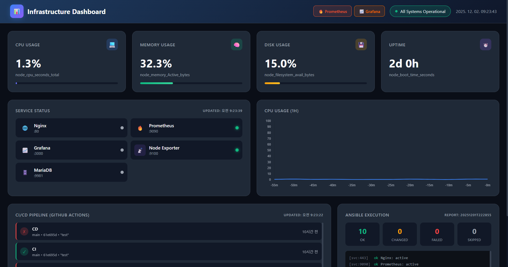

# INFRA - Infrastructure Monitoring Dashboard

실시간 인프라 모니터링 대시보드. 다수의 서버 메트릭, Kubernetes 클러스터 상태, CI/CD 파이프라인을 단일 화면에서 통합 모니터링합니다.

**Live**: https://infra.deok.kr



---

## 기술 스택

| 영역 | 기술 |
|------|------|
| Frontend | HTML5, CSS3, Vanilla JavaScript (ES6 Modules) |
| Charts | Chart.js 3.9.1 (CDN) |
| Backend API | Python Flask, Flask-CORS |
| Monitoring | Prometheus, Node Exporter |
| Visualization | Grafana |
| Container | Kubernetes (K3s), kube-state-metrics |
| Database | MariaDB |
| Web Server | Nginx (리버스 프록시 + 정적 파일 서빙) |
| OS | Rocky Linux 9 |

---

## 프로젝트 구조

```
infra/
├── index.html                    # SPA 진입점
├── api/
│   └── server.py                 # Flask API (서버 설정 CRUD)
├── assets/
│   ├── css/
│   │   ├── variables.css         # CSS 변수, 다크 테마, 색상 정의
│   │   ├── layout.css            # 그리드 레이아웃, 반응형
│   │   └── components.css        # 카드, 버튼, 모달 등 UI 컴포넌트
│   ├── js/
│   │   ├── app.js                # 앱 초기화, 라우터 마운트
│   │   ├── api.js                # 데이터 fetch (Prometheus, K8s, GitHub)
│   │   ├── config.js             # 전역 설정 (URL, 갱신주기, 모니터링 대상)
│   │   ├── router.js             # 해시 기반 SPA 라우터
│   │   └── pages/
│   │       ├── overview.js       # 서버 목록 + 상태 요약
│   │       ├── detail.js         # 서버 상세 메트릭 (차트)
│   │       └── admin.js          # 서버 관리 (추가/수정/삭제)
│   └── data/
│       └── servers.json          # 서버 목록 및 임계치 설정
└── docs/
    └── preview.png
```

---

## 주요 기능

**서버 모니터링** — CPU, Memory, Disk 사용률 실시간 조회. 임계치 기반 상태 판정 (정상/경고/위험/오프라인).

**서버 상세** — CPU·메모리 1시간 히스토리 차트, 네트워크 트래픽(In/Out), 디스크 I/O, Load Average 표시.

**Kubernetes 클러스터** — Pod 상태(Running/Pending/Failed), Node Ready 상태, 클러스터 통계.

**CI/CD 파이프라인** — GitHub Actions 워크플로우 실행 현황. infra / salm / mgmt 3개 레포 통합 표시.

**서버 관리** — Admin 페이지에서 서버 추가/수정/삭제. Node Exporter 인스턴스 등록, 프로젝트 분류, 임계치 설정.

---

## 데이터 소스

| 데이터 | 소스 | 갱신 주기 |
|--------|------|----------|
| 시스템 메트릭 (CPU, Memory, Disk) | Prometheus → Node Exporter | 10초 |
| 서비스 상태 | Prometheus `up` 메트릭 | 10초 |
| Kubernetes 상태 | Prometheus → kube-state-metrics | 10초 |
| CI/CD 워크플로우 | GitHub Actions API (Nginx 프록시) | 60초 |

---

## 모니터링 대상

**서버** — 총 10대 (메인서버 1, TEST 5, DATALAKE 4)

**서비스** — Nginx, Prometheus, Grafana, Node Exporter, MariaDB, Kube State Metrics

**임계치 기본값**

| 메트릭 | Warning | Critical |
|--------|---------|----------|
| CPU | 70% | 80% |
| Memory | 70% | 80% |
| Disk | 80% | 90% |

---

## 실행 방법

### Frontend

Nginx 또는 정적 파일 서버로 프로젝트 루트를 서빙합니다. 빌드 과정 없이 바로 동작합니다.

```bash
# 로컬 개발 시
python -m http.server 8080
```

> Prometheus, GitHub API 프록시 등 실제 데이터 연동은 Nginx 설정이 필요합니다.

### Backend API

```bash
cd api
pip install flask flask-cors
python server.py
```

개발 모드로 `localhost:5000`에서 실행됩니다. 프로덕션에서는 gunicorn을 사용합니다.

---

## Nginx 설정 (참고)

```nginx
# GitHub API 프록시 (토큰 서버사이드 주입)
location /api/github/ {
    proxy_pass https://api.github.com/;
    proxy_set_header Authorization "token ${GITHUB_TOKEN}";
    proxy_set_header Accept "application/vnd.github.v3+json";
    proxy_set_header User-Agent "infra-dashboard";
    proxy_ssl_server_name on;
}
```

---

## Author

- GitHub: [@wlsejrdyd](https://github.com/wlsejrdyd)
- Email: wlsejrdyd@gmail.com
